## Machine Learning Solution Predicting Road Accident Severity


<br>
<br>
<p align="center">
  
</p>
<br>

1. [Introduction](#introduction)
   - [Project Description](#description)
   - [Project Motivation](#motivation)

2. [Project Overview](#project_overview)
   - [Dataset Overview](#datasetoverview)
   - [Problem Statement](#problemstatement)

3. [Features](#features)

4. [Project Directory Structure](#directorystructure)

5. [Steps](#steps)
   - [Data Collection and Preprocessing](#data-preprocessing)
   - [Calculating Word Counts and Likelihoods](#data-preprocessing)
   - [Train-Test Split and Model Training](#model-development)
   - [Running the App](#evaluation-and-metrics)
   - [Interact with the App](#evaluation-and-metrics)

6. [Requirements](#requirements)

7. [Usage](#usage)

8. [Screenshots](#screenshots)

9. [EDA Notebook Structure](#eda)
   - [Running the Notebook](#exploratory-data-analysis1)
   - [Results and Visualizations](#exploratory-data-analysis2)

10. [License](#license)

11. [Acknowledgements](#acknowledgements)

12. [Contact Information](#contact)


## Installation <a name="Installation"></a>
The code requires Python versions of 3.*, following libraries and packages used in this project:

* **pandas**: A versatile and powerful data manipulation library that is instrumental in data analysis and preprocessing tasks.

* **streamlit**: A user-friendly Python library that simplifies the creation of web applications and interactive dashboards, making it easy to showcase project results.

* **plotly**: A library used to create interactive and visually appealing plots and charts, enhancing data visualization capabilities.

* **scikit-learn**: A comprehensive and widely-used machine learning library that provides tools for building, training, and evaluating machine learning models.

* **kaggle**: The Kaggle API, which allows access to datasets and competitions hosted on Kaggle, facilitating data retrieval and participation in machine learning challenges.

* **imblearn**: A library specifically designed for addressing imbalanced datasets by providing techniques for resampling and handling class imbalances.

* **pyyaml**: A Python library used for working with YAML configuration files, often utilized to manage project configurations.

* **lightgbm**: A gradient boosting framework known for its efficiency and performance, frequently used in machine learning tasks.

* **catboost**: A gradient boosting library with a strong focus on handling categorical features effectively, contributing to improved model accuracy.

* **xgboost**: An optimized gradient boosting library that is renowned for its speed and ability to achieve high performance in machine learning tasks.

* **feature_engine**: A library that specializes in feature engineering and data preprocessing, aiding in data transformation and preparation for model training.

* **scikit-optimize**: A library used for hyperparameter tuning and Bayesian optimization, assisting in finding optimal model configurations.

* **shap**: A library that plays a crucial role in explaining machine learning models and interpreting their predictions, enhancing model transparency and understanding.

## Introduction <a name="introduction"></a>
### Project Description <a name="discription"></a>

This is Machine learning project focused on multiclass classification to predict the severity of road accidents. The objective is to classify accidents into three categories: minor, severe, and fatal. The dataset used for the project is based on real-world data and is highly imbalanced.

### Project Motivation <a name="motivation"></a>

Road accidents have a substantial impact on the occurrence of unnatural deaths worldwide. Governments are dedicated to increasing awareness of road safety regulations and rules in order to minimize the number of fatalities. Hence, it is of utmost importance to develop a mechanism capable of predicting the severity of accidents. This Machine Learning predictive capability can play a vital role in reducing fatalities effectively.

## Project Overview <a name="project_overview"></a>
### Overview RTA Dataset <a name="datasetoverview"></a>
This data set is collected from _Addis Ababa_ Sub city police departments for Masters research work. The data set has been prepared from manual records of road traffic accident of the year _2017-20_. All the sensitive information have been excluded during data encoding and finally it has 31 features and 12316 instances of the accident. Then it is preprocessed and for identification of major causes of the accident by analyzing it using different **machine learning classification algorithms algorithms**.

   ### RTA Problem statement <a name="problemstatement"></a>
The objective of this project is to classify the "Accident_severity" feature, which is a multi-class variable, based on the other 31 features available. We will follow a step-by-step approach to complete the data science process and tasks. The evaluation metric we will use to assess our model's performance is the "F1 score."

## Project Plan <a name="datasetoverview"></a>

In this project, we are addressing the challenge of working with an imbalanced dataset. Our objective is to explore various data preprocessing techniques to mitigate this issue. Some commonly employed techniques include **oversampling**, **undersampling**, **class weighting**, and **combining oversampling and undersampling**.

In the initial phase, we will commence by splitting the dataset into training and testing sets using **stratified splitting**. Following that, we will perform basic feature engineering and address missing values using the **K-nearest neighbors (KNN)** imputation method. Subsequently, we will delve into generating synthetic data through different techniques, such as **oversampling**, **undersampling**, and a **combination of both**. These generated datasets will be saved for later use.

Our base model for this project will be the **random forest** algorithm. We will evaluate the performance of various **sampling techniques** to determine which one yields the best results. The top-performing techniques will be shortlisted and saved in a YAML file for future reference.

Next, we will explore a variety of classification models, including **CatBoost**, **ExtraTrees**, **XGBoost**, and others, to assess their performance. We will also employ **tree-based feature importance techniques** to identify the top 10 features that contribute the most to predictive accuracy. These top features will then be evaluated using the aforementioned classification models.

Upon completing these steps, we will identify the best-performing model and proceed with **hyperparameter tuning** to further enhance its performance.

<p align="center"> 
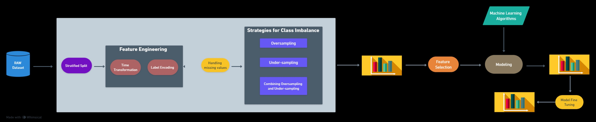
</p>

## RTA Classification - EDA <a name="EDA"></a>

As we all know that the objective of Exploratory Data Analysis (EDA) is to gain insights and understanding from a dataset before applying any specific statistical or machine learning techniques. EDA involves examining and visualizing the data to uncover patterns, spot anomalies, and discover relationships between variables. It helps us to formulate hypotheses, identify data quality issues, and make informed decisions about the next steps in their analysis.

**The EDA Notebook is available [here](http://nbviewer.jupyter.org/github/marcotav/deep-learning/blob/master/painters-identification/notebooks/capstone-models-final-model-building.ipynb).**

I have used Infographics which is a powerful tool to explain the EDA in a visually appealing and easily understandable manner. Following is infographics for RTA dataset. 

<p align="center"> 

</p>
<p align="center"> 

</p>
<p align="center"> 

</p>
<p align="center"> 

</p>
<p align="center"> 
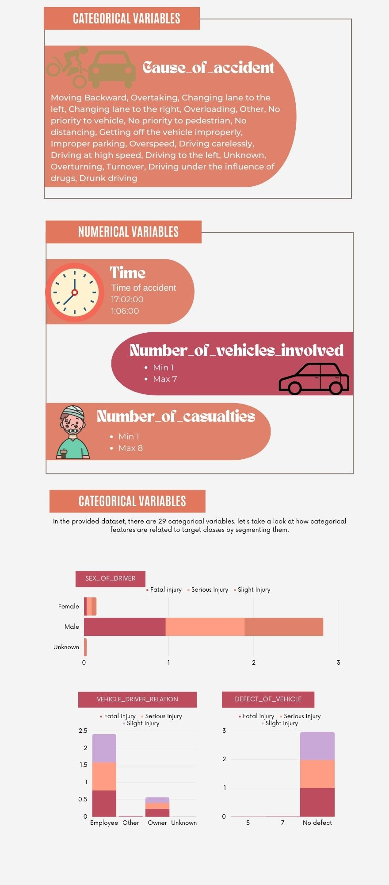
</p>
<p align="center"> 
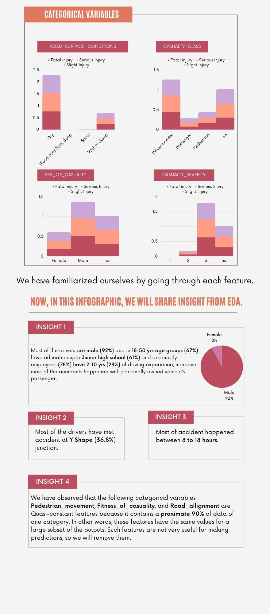
</p>


## Project structure
```bash
├── data
│   ├── final                      # Data after training the model
│   │   └── feature_importances    # Feature importance data
│   ├── processed                  # Data after preprocessing
│   │   └── sample_data            # Processed sample data
│   └── raw                        # Raw data
├── .gitignore                     # Gitignore configuration
├── Makefile                       # Makefile for useful commands
├── models                         # Directory to store trained models
├── notebooks                      # Notebooks directory
├── requirements.txt               # List of project dependencies
├── README.md                      # Project README
├── src                            # Source code directory
│   ├── get_dataset.py             # Script to download data
│   ├── preprocessing.py           # Script for data preprocessing
│   ├── oversampler.py             # Script for oversampling techniques
│   ├── undersampler.py            # Script for undersampling techniques
│   ├── combined_sampling.py       # Script for combined sampling
│   ├── Analyzing_Synthetic_Data.py # Script for analyzing synthetic data
│   ├── base_model_evaluation.py   # Script for evaluating base models with synthetic data
│   ├── classification_model_evaluation_FS.py # Script for evaluating models with feature selection
│   ├── feature_selection.py       # Script for feature selection
│   ├── feature_selection_analysis.py # Script for evaluating models after feature selection
│   ├── hp_tunnig_et.py            # Script for hyperparameter tuning of the ExtraTree model
│   └── train_and_evaluate_model.py # Script for training and evaluating the ExtraTree model


```
## Usage <a name="Usage"></a>
#### 1. Clone this repository:
```bash
git clone https://github.com/zubairashfaque/Road-Traffic-Accident-Classification
```
#### 2. Run the following command to create a virtual environment named "RTA" (you can replace "RTA" with any name you prefer):
```bash
python -m venv RTA
```
#### 3. To activate the virtual environment, use the following command:
```bash
RTA\Scripts\activate
```

#### 4. To install the necessary packages from the `requirements.txt` file, you have two convenient options:

Option 1: Run the following command directly in your terminal:

```bash
pip install -r requirements.txt
```

Option 2: Alternatively, if you prefer using a Makefile for streamlined setup, you can execute the following command:

```bash
make install
```

Either of these methods will ensure that all required packages are installed, setting up your environment for seamless project execution.

#### 5. To download the RTA dataset, you have two options:

Option 1: Run the following command directly in your terminal:

```bash
python src/get_dataset.py
```

Option 2: If you prefer using a Makefile, you can execute the following command:

```bash
make download_data
```

Both of these commands automate the process of fetching the RTA dataset, making it easily accessible for subsequent analysis and preprocessing.

#### 6. To preprocess the CSV Road Traffic Accident (RTA) dataset, you can choose from two straightforward options:

Option 1: Run the following command directly in your terminal:

```bash
python src/preprocessing.py data/raw/ data/processed
```

Option 2: Alternatively, if you prefer using a Makefile to streamline the preprocessing process, you can execute the following command:

```bash
make exe_preprocessing
```

Either of these methods will initiate the dataset preprocessing, ensuring that it's ready for further analysis and machine learning tasks.

#### 7. To employ various oversampling techniques and generate synthetic samples for minority class instances in the dataset, you can choose from two convenient options:

Option 1: Run the following command directly in your terminal:

```bash
python src/oversampler.py data/raw/ data/processed
```

Option 2: Alternatively, if you prefer using a Makefile to streamline the oversampling process, you can execute the following command:

```bash
make gen_oversampler
```

Using either of these methods, you can effectively address class imbalance issues and enhance the dataset for improved machine learning model training and performance.

#### 8. To employ various undersampling techniques to address class imbalance in the dataset, you have two convenient options:

Option 1: Run the following command directly in your terminal:

```bash
python src/undersampler.py data/raw/ data/processed
```

Option 2: Alternatively, if you prefer using a Makefile to streamline the undersampling process, you can execute the following command:

```bash
make gen_undersampler
```

By choosing either of these methods, you can effectively mitigate class imbalance issues, resulting in an improved dataset for machine learning model training and enhanced performance.

#### 9. To effectively address class imbalance in the dataset by combining both undersampling and oversampling techniques, you have two convenient options:

Option 1: Run the following command directly in your terminal:

```bash
python src/combined_sampling.py data/raw/ data/processed
```

Option 2: Alternatively, if you prefer using a Makefile to streamline the process, you can execute the following command:

```bash
make gen_combined_sampling
```

By choosing either of these methods, you can implement a balanced sampling strategy to enhance your dataset for machine learning model training and achieve improved model performance.

#### 10.   To evaluate the performance of undersampling and oversampling techniques, you have two convenient options:

Option 1: Run the following command directly in your terminal:

```bash
python src/Analyzing_Synthetic_Data.py
```

Option 2: Alternatively, if you prefer using a Makefile to streamline the process, you can execute the following command:

```bash
make analyze_synthetic_data
```

By choosing either of these methods, you can assess the effectiveness of various sampling strategies and make informed decisions to enhance your dataset for machine learning model training.

#### 11.   To evaluate the performance of undersampling and oversampling techniques, you have two convenient options:

Option 1: Run the following command directly in your terminal:

```bash
python src/Analyzing_Synthetic_Data.py
```

Option 2: Alternatively, if you prefer using a Makefile to streamline the process, you can execute the following command:

```bash
make analyze_synthetic_data
```

By choosing either of these methods, you can assess the effectiveness of various sampling strategies and make informed decisions to enhance your dataset for machine learning model training.

#### 12.   To evaluate multiple classification models on different datasets generated using undersampling and oversampling techniques, you have two convenient options:

Option 1: Run the following command directly in your terminal:

```bash
python src/base_model_evaluation.py
```

Option 2: Alternatively, if you prefer using a Makefile to streamline the process, you can execute the following command:

```bash
make base_model_evaluation
```

By choosing either of these methods, you can assess the performance of various classification models on differently sampled datasets, helping you make informed decisions to enhance your dataset for machine learning model training.

#### 13.   To perform feature selection and evaluate classification models with precision, you have two convenient options:

Option 1: Run the following command directly in your terminal:

```bash
python src/classification_model_evaluation_FS.py
```

Option 2: Alternatively, if you prefer using a Makefile to streamline the process, you can execute the following command:

```bash
make base_model_evaluation_FS
```

By choosing either of these methods, you can thoroughly assess the performance of various classification models, including feature selection, to enhance your dataset for more effective machine learning model training.

#### 14.   To perform tree-based feature selection and evaluate classification models with precision, you have two convenient options:

Option 1: Run the following command directly in your terminal:

```bash
python src/feature_selection.py
```

Option 2: Alternatively, if you prefer using a Makefile to streamline the process, you can execute the following command:

```bash
make feature_selection
```

By choosing either of these methods, you can meticulously assess the performance of various classification models, including tree-based feature selection, to enhance your dataset for more effective machine learning model training.

#### 15.   To evaluate feature selection and assess classification models with precision, you have two convenient options:

Option 1: Run the following command directly in your terminal:

```bash
python src/feature_selection_analysis.py
```

Option 2: Alternatively, if you prefer using a Makefile to streamline the process, you can execute the following command:

```bash
make feature_selection_eval
```

By choosing either of these methods, you can meticulously evaluate the performance of various classification models, including feature selection, to enhance your dataset for more effective machine learning model training.

#### 16.   To perform hyperparameter tuning for the ExtraTreesClassifier, you have two convenient options:

Option 1: Run the following command directly in your terminal:

```bash
python src/hp_tunnig_et.py
```

Option 2: Alternatively, if you prefer using a Makefile to streamline the process, you can execute the following command:

```bash
make hyper_parametr_tuning
```

By choosing either of these methods, you can meticulously fine-tune the hyperparameters of the ExtraTreesClassifier for more effective machine learning model training.

#### 17.   To evaluate the tuned ExtraTree Model, you have two convenient options:

Option 1: Run the following command directly in your terminal:

```bash
python src/train_and_evaluate_model.py
```

Option 2: Alternatively, if you prefer using a Makefile to streamline the process, you can execute the following command:

```bash
make Eval_hyper_parametr_tuning
```

By choosing either of these methods, you can meticulously assess the performance of the tuned ExtraTreesClassifier for more effective machine learning model training.

#### 18.   To run the whole pipeline use the following command:
```bash
make setup
```

This script automates the process of downloading a dataset from Kaggle, managing files, and making specific adjustments to file names. Below is a detailed breakdown of the script's functionalities:

1. **Importing Libraries:** The script imports necessary Python libraries, including `os`, `KaggleApi` from `kaggle.api.kaggle_api_extended`, and `shutil`.

2. **Setting Kaggle Credentials:** It ensures that your Kaggle API credentials (username and key) are configured using environment variables.

3. **Specifying Dataset:** The script identifies the target Kaggle dataset to download, which is named "saurabhshahane/road-traffic-accidents."

4. **Setting Download Directory:** It designates the directory where the downloaded dataset will be stored, typically named "data/raw."

5. **Initializing Kaggle API:** The Kaggle API is initialized and authenticated with the provided credentials, allowing seamless interaction with Kaggle's dataset repository.

6. **Creating Data Directory:** If the specified data directory does not already exist, the script creates it to ensure a suitable location for the downloaded dataset.

7. **Downloading and Unzipping:** The script proceeds to download the dataset files from Kaggle, storing them in the designated data directory. Any downloaded ZIP files are automatically extracted.

8. **Listing Downloaded Files:** The script generates a list of files that were successfully downloaded and made available for further processing.

9. **File Management:** It identifies a specific file, "cleaned.csv," for potential deletion, and plans to rename another file, "RTA_Dataset.csv."

10. **Deletion:** If "cleaned.csv" exists in the data directory, the script removes the file and provides a notification confirming the deletion.

11. **File Renaming:** In case "RTA Dataset.csv" is present in the data directory, the script renames it to "RTA_Dataset.csv" using the `shutil.move` function. It then reports that the renaming process has been completed.

In essence, this script streamlines the process of dataset acquisition, organization, and file management tasks, enhancing efficiency when working with Kaggle datasets.

### Overview of the ***preprocessing.py*** Script
```bash
python src/preprocessing.py data/raw/ data/processed
```

The `preprocessing.py` script is a Python program tailored for the preprocessing of a CSV file containing road traffic accident (RTA) data. This script streamlines several essential data preprocessing tasks and ultimately stores the processed data into a new CSV file. Below is an overview of the key functionalities provided by this script:

1. **Data Loading:** The script reads an input CSV file containing RTA data into a Pandas DataFrame, facilitating data manipulation and analysis.

2. **Column Dropping:** Unnecessary columns within the DataFrame are systematically dropped to enhance data clarity and model performance.

3. **Cross-Validation Data Split:** The data is segmented into folds using StratifiedKFold, a technique particularly useful for cross-validation in machine learning.

4. **Datetime Conversion:** The script transforms the 'Time' column into a datetime format, allowing for precise time-based analysis. Additionally, it extracts the hour and minute components for further insights.

5. **Session Creation:** A novel 'session' column is generated based on the 'hour' information. Predefined time intervals, such as 'morning' and 'evening,' are used to categorize data instances, enriching the dataset with temporal context.

6. **Column Removal:** The original 'Time' column, which has been converted and processed, is no longer required and is subsequently removed from the dataset.

7. **Categorical Column Encoding:** Ordinal encoding is performed on categorical columns (excluding the target column) to convert textual or categorical data into numerical format, making it suitable for machine learning algorithms.

8. **Label Encoding:** The target column, 'Accident_severity,' is encoded using label encoding, facilitating the application of machine learning classification algorithms.

9. **Missing Value Imputation:** Missing values in the dataset are imputed using K-Nearest Neighbors (KNN) imputation, preserving data integrity and completeness.

10. **Data Export:** The processed DataFrame is saved as a new CSV file, ensuring that the cleaned and transformed data is readily available for machine learning tasks.


### Overview of the ***oversampler.py*** Script
```bash
python src/oversampler.py data/processed data/processed/sample_data
```

## Overview of `oversampler.py`

The `oversampler.py` script is specifically designed to address the challenge of class imbalance in datasets, a common issue in machine learning. It employs various oversampling techniques to generate synthetic samples for minority class instances, effectively mitigating the imbalance problem. Here's an overview of the key functionalities provided by this script:

1. **Importing Libraries:** The script imports essential libraries, including `os`, `pandas`, and multiple oversampling techniques from the `imblearn` library. Additionally, it uses `SVC` from `sklearn.svm`.

2. **Suppressing Warnings:** Specific warning messages are suppressed to maintain a clean and uncluttered output.

3. **Oversampling Techniques:** The script defines a dictionary (`oversampler_dict`) that encompasses various oversampling techniques along with their respective configurations:

   - RandomOverSampler: Randomly augments the minority class by creating duplicate instances.
   - SMOTE (Synthetic Minority Over-sampling Technique): Generates synthetic samples based on nearest neighbors.
   - ADASYN (Adaptive Synthetic Sampling): Focuses on generating synthetic samples for instances that are challenging to classify.
   - BorderlineSMOTE (Borderline Synthetic Minority Over-sampling Technique): Emphasizes oversampling for samples near the decision boundary.
   - SVMSMOTE (Support Vector Machine Synthetic Minority Over-sampling Technique): Utilizes SVM to create synthetic samples.

4. **Oversampling Function:** The script defines the `oversampler_run` function, responsible for executing oversampling on a specific fold of cross-validation. It takes input data, applies one of the techniques from `oversampler_dict`, and then saves the resampled data as new CSV files.

5. **Main Script Execution:** In the primary part of the script, it expects command-line arguments specifying the input directory and output directory. The script then proceeds to iterate over five folds of cross-validation and applies oversampling using a range of techniques:

   - RandomOverSampler
   - SMOTE
   - ADASYN
   - BorderlineSMOTE (with two variants: borderline-1 and borderline-2)
   - SVMSMOTE

6. For each oversampling technique, it preserves the augmented training data and retains the original validation data in separate CSV files. These saved files are named based on the specific oversampler used and the fold number.


### Overview of the ***undersampler.py*** Script
```bash
python src/undersampler.py data/processed data/processed/sample_data
```

The `undersampler.py` script  is specifically designed to address the challenge of class imbalance in machine learning datasets by applying various undersampling techniques. It reduces the number of majority class instances, bringing balance to the dataset. Here's an overview of the script's functionalities and the undersampling techniques it employs:

1. **Importing Libraries:** The script imports essential libraries, including `os`, `pandas`, `warnings`, and multiple undersampling techniques from the `imblearn` library.

2. **Undersampling Techniques:** It defines a dictionary (`undersampler_dict`) containing diverse undersampling techniques, each with its specific configurations:

   - RandomUnderSampler: Randomly eliminates samples from the majority class.
   - TomekLinks: Removes samples forming Tomek links, which are pairs of samples from different classes that are each other's nearest neighbors.
   - OneSidedSelection: Eliminates samples using one-sided selection with nearest neighbors.
   - EditedNearestNeighbours: Discards samples based on the editing process utilizing nearest neighbors.
   - RepeatedEditedNearestNeighbours: Iteratively applies EditedNearestNeighbours for further reduction.
   - AllKNN: Removes samples based on the AllKNN algorithm.
   - NearMiss (two versions - version 1 and version 2): Removes samples using NearMiss, a technique focusing on nearest neighbors.

3. **Undersampling Function:** The script defines the `undersampler_run` function, responsible for executing undersampling for a specific fold of cross-validation. It accepts input data, applies one of the techniques from `undersampler_dict` to the training data, and then saves both the undersampled data and the original validation data as separate CSV files.

4. **Main Script Execution:** In the main part of the script, it expects command-line arguments specifying the input directory and output directory. The script then proceeds to iterate over five folds of cross-validation and applies undersampling using a variety of techniques:

   - RandomUnderSampler
   - TomekLinks
   - OneSidedSelection
   - EditedNearestNeighbours
   - RepeatedEditedNearestNeighbours
   - AllKNN
   - NearMiss (version 1)
   - NearMiss (version 2)

5. For each undersampling technique, it saves both the undersampled training data and the original validation data in separate CSV files. The naming convention for these saved files is based on the specific undersampler used and the fold number.

### Overview of the ***combined_sampling.py*** Script
```bash
python src/combined_sampling.py data/processed data/processed/sample_data
```

The `combined_sampling.py` script is a versatile tool designed to tackle class imbalance in machine learning datasets by skillfully combining both undersampling and oversampling techniques. It creates balanced datasets by harmoniously merging specific undersampling and oversampling methods. Here's an overview of the script's functionalities and the combined sampling techniques it employs:

1. **Importing Libraries:** The script imports essential libraries, including `os`, `pandas`, `warnings`, and various oversampling and undersampling techniques from the `imblearn` library.

2. **Creating Sampling Objects:** It initiates specific oversampling and undersampling objects (`sm`, `enn`, `tl`) with predefined configurations:
   - `sm` is an instance of SMOTE (Synthetic Minority Over-sampling Technique).
   - `enn` is an instance of EditedNearestNeighbours.
   - `tl` is an instance of TomekLinks.

3. **Combined Sampling Techniques:** The script defines a dictionary (`under_oversamp_dict`) that ingeniously combines these sampling techniques:
   - `under_oversamp_smtomek`: Blends SMOTE oversampling with TomekLinks undersampling.
   - `under_oversamp_smenn`: Fuses SMOTE oversampling with EditedNearestNeighbours undersampling.

4. **Sampling Function:** The script introduces the `under_oversamp_run` function, which takes charge of performing under-oversampling for a particular fold of cross-validation. It efficiently loads the processed data, applies one of the combined techniques from `under_oversamp_dict`, and then astutely saves both the resampled training data and the original validation data as separate CSV files.

5. **Script Execution:** In the main part of the script, it awaits command-line arguments specifying the input directory and output directory. The script methodically traverses over five folds of cross-validation and applies the meticulously crafted combined under-oversampling techniques:

   - SMOTE + TomekLinks (`under_oversamp_smtomek`)
   - SMOTE + EditedNearestNeighbours (`under_oversamp_smenn`)

6. For each unique technique, it systematically preserves the resampled training data and the original validation data in dedicated CSV files. The files' nomenclature is derived from the combined technique used and the fold number.


### Overview of the ***Analyzing_Synthetic_Data.py*** Script
```bash
python src/Analyzing_Synthetic_Data.py
```

The `Analyzing_Synthetic_Data.py` script is a robust tool meticulously crafted for conducting machine learning experiments on imbalanced datasets. It ingeniously combines a diverse array of sampling techniques, including oversampling, undersampling, and under-oversampling methods. Its primary objective is to address class imbalance while rigorously evaluating the performance of a Random Forest classifier. Below is an encapsulation of the script's functionalities and the gamut of sampling techniques it harnesses:

1. **Sampling Dictionaries:** The script opens its repertoire with a set of dictionaries tailored for diverse sampling techniques. These dictionaries are categorized into:
   - **Oversampling** (`oversampler_dict`): Contains specific oversampling methods sourced from the imbalanced-learn (`imblearn`) library.
   - **Undersampling** (`undersampler_dict`): Encompasses a spectrum of undersampling methods.
   - **Combined Under-Oversampling** (`under_oversamp_dict`): Features the fusion of under- and oversampling techniques for a holistic approach.

2. **Parameter Dictionary:** The script further enriches its arsenal with a versatile parameter dictionary (`param_dict`). This dictionary allows users to flexibly define cross-validation folds and select their preferred sampling methods, empowering them with fine-grained control over experimentation.

3. **`sampler_run_2` Function:** At the heart of this script lies the `sampler_run_2` function. This function orchestrates the training and evaluation of a Random Forest classifier using an assorted array of sampling techniques. It executes the following steps:
   - Loads the training and validation data for each specified sampling method.
   - Fits the classifier on the data.
   - Computes the F1-score as a robust performance metric.

4. **Generate F1 Score Graph:** The script introduces the `generate_f1_score_graph` function, an innovative masterstroke. This function traverses through the defined folds, invoking the `sampler_run_2` function for each fold and sampling method. It diligently aggregates the results, facilitating the creation of a comprehensive bar graph using Plotly Express. This graph serves as a visual beacon, illuminating the landscape of F1 scores achieved by different methods across various folds. The resulting graph is thoughtfully preserved as an HTML file.

5. **Main Execution:** In the main execution segment, the script calls upon the `generate_f1_score_graph` function, setting in motion the generation of the F1 score graph and ensuring its safe storage. Additionally, it extracts and proudly displays a list of the crème de la crème—top-performing files based on F1 scores. These champion files are then ceremoniously enshrined in a YAML file (`top_sample_list.yaml`).

```bash
Print the list of top-average File_names
['oversampler_random_0_test.csv', 'oversampler_adasyn_0_test.csv', 'under_oversamp_smtomek_0_test.csv', 'oversampler_svm_0_test.csv', 'oversampler_smote_0_test.csv']
top_sample_list.yaml has been created.
```
### Overview of the ***base_model_evaluation.py*** Script
```bash
python src/base_model_evaluation.py
```

The `base_model_evaluation.py` script is to model evaluation and dataset analysis:

1. **Loading Data:** The script commences its journey by loading a list of file names from a YAML file. Each file name in this list represents a meticulously crafted dataset, thoughtfully split into training and testing sets.

2. **Model Evaluation:** Armed with datasets, the script embarks on an odyssey of model evaluation. It meticulously executes the following steps for each dataset pair:
   - Loads the training and testing data.
   - Segregates the data into two distinct entities: feature vectors (X) and target labels (y).
   - Harnesses an impressive ensemble of classification models, including Decision Trees, Random Forests, GBM (Gradient Boosting Machine), AdaBoost, Extra Trees, XGBoost, LightGBM, CatBoost, and HistGradientBoosting.
   - Wields the mighty sword of F1 weighted score calculation to assess the performance of each model on the testing data.

3. **Graph Generation:** The script demonstrates its artistic flair by crafting captivating bar plots. For each training dataset, it conjures these visual masterpieces using Plotly Express, providing an insightful window into the world of F1 weighted scores for different classification models. These plots are meticulously preserved as HTML files, ready to enlighten the observer.

4. **Data Summary:** The script doesn't stop at visual marvels; it is also a maestro of data organization. It forges a structured DataFrame, akin to a symphony of numbers. This DataFrame encapsulates the essence of F1 scores for all training and testing dataset duets. Like a diligent conductor, it calculates the mean F1 score for each training dataset, enriching the DataFrame with this harmonic metric.

5. **Saving Results:** The script is an archivist, preserving the fruits of its labor for posterity. It saves the following artifacts:
   - Pristine F1 score graphs, one for each training dataset, a testament to model performance.
   - The structured DataFrame chronicling the F1 scores, conserved as a CSV file.
   - A sacred scroll, the list of top-performing training datasets. This scroll, enshrined in a YAML file, is a guidepost for the discerning.

6. **Output:** The script is not reticent; it rejoices in sharing its accomplishments. It utters messages to signify the completion of tasks and unfurls the scroll of top-performing training datasets, a treat for those who seek excellence.


<p align="center"> 
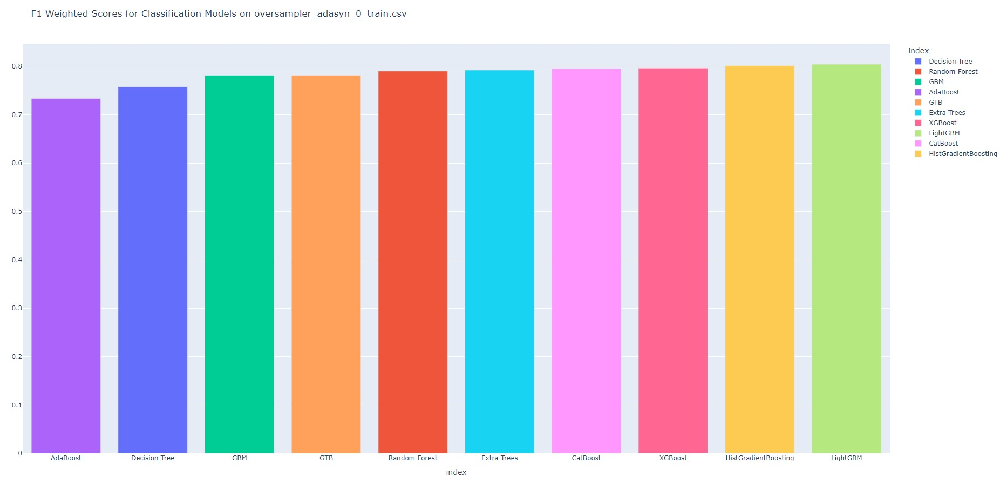
</p>

<p align="center"> 
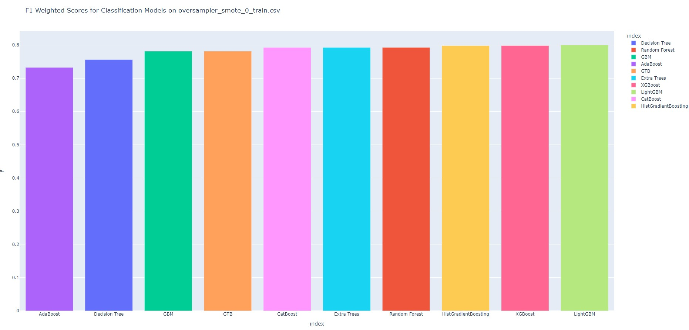
</p>
<p align="center"> 
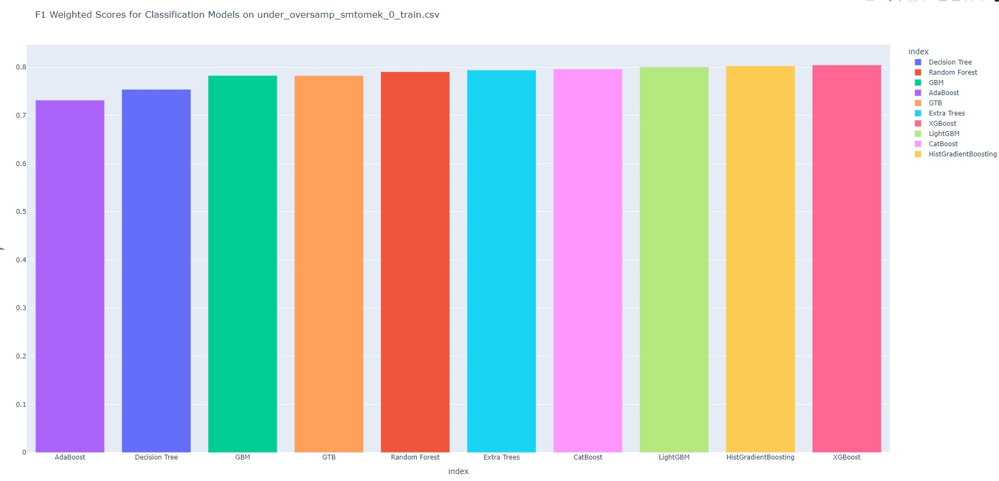
</p>
<p align="center"> 
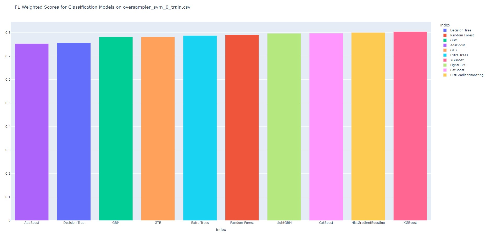
</p>

### Overview of the ***classification_model_evaluation_FS.py*** Script
```bash
python src/classification_model_evaluation_FS.py
```

The `classification_model_evaluation_FS.py` script is a powerhouse of data-driven decision-making. It executes a series of essential tasks in the realm of feature engineering and model evaluation with precision. Its key functionalities encompass:

1. **Loading Data:** The script commences its mission by loading a curated list of file names from a YAML file. Each file name in this list represents a top-performing training dataset, meticulously selected for its prowess.

2. **Feature Engineering and Model Evaluation:** Armed with the top-performing training datasets, the script embarks on a voyage of enlightenment. For each dataset, it methodically executes the following steps:
   - Loads the training and testing data, the raw ingredients of wisdom.
   - Divides the data into two facets: feature matrices (X) and target labels (y).
   - Wields the magic wand of feature engineering, conjuring a pipeline of transformations. It deftly drops constant and duplicate features, ensuring the dataset's purity, and selects relevant features using smart correlated selection.
   - Summons an ensemble of classification models, including Decision Trees, Random Forests, GBM (Gradient Boosting Machine), AdaBoost, Extra Trees, XGBoost, LightGBM, CatBoost, and HistGradientBoosting.
   - Harnesses the F1 weighted score as the discerning metric to evaluate each model's performance on the sacred testing data.

3. **Graph Generation:** The script doesn't just process data; it is also an artist. For each top-performing training dataset, it crafts elegant bar plots using the magic of Plotly Express. These plots unveil the nuanced F1 weighted scores for various classification models after the alchemy of feature engineering. These visual masterpieces are bestowed with life as HTML files, ready to inspire.

4. **Data Summary:** The script is a mathematician, weaving numbers into insightful narratives. It assembles a structured DataFrame, akin to a symphony of statistics. This DataFrame encapsulates the essence of F1 scores for all top-performing training datasets post-feature engineering. It goes a step further, calculating the mean F1 score for each training dataset and etching it as a new column in the DataFrame.

5. **Saving Results:** The script is an archivist, preserving the fruits of its labor for posterity. It conserves the following artifacts:
   - Pristine F1 score graphs, each a testament to model performance after feature engineering.
   - The structured DataFrame, a repository of F1 scores post-feature engineering, meticulously chronicled as a CSV file.

6. **Output:** The script is not reticent; it rejoices in sharing its accomplishments. It vocalizes messages, signifying the completion of tasks, and leaves behind a legacy of insights.

In summary, the `classification_model_evaluation_FS.py` script is a sage of feature engineering and model evaluation. It skillfully evaluates a multitude of classification models on top-performing training datasets after the alchemical process of feature engineering. It forges visual narratives and numerical summaries, shedding light on the complex interplay of data and models. This script is an indispensable asset for data scientists and researchers seeking enlightenment in the world of machine learning and feature engineering.

*Note: Executing this script unveils a tapestry of insights and wisdom.*
<p align="center"> 
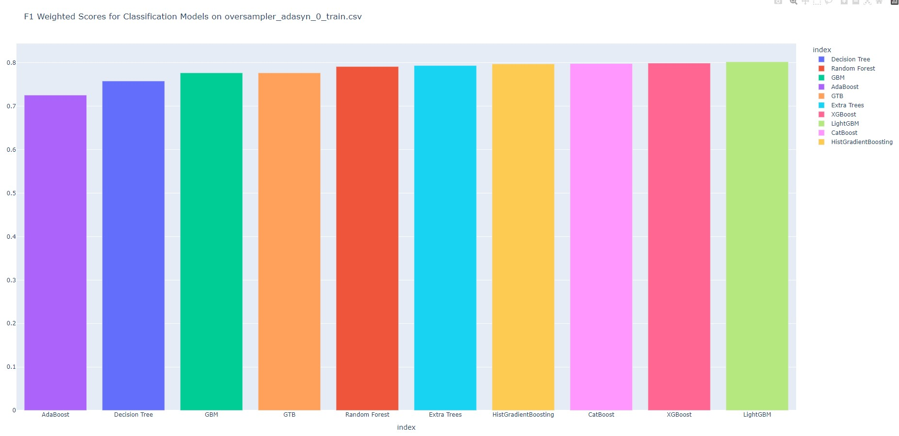
</p>

<p align="center"> 
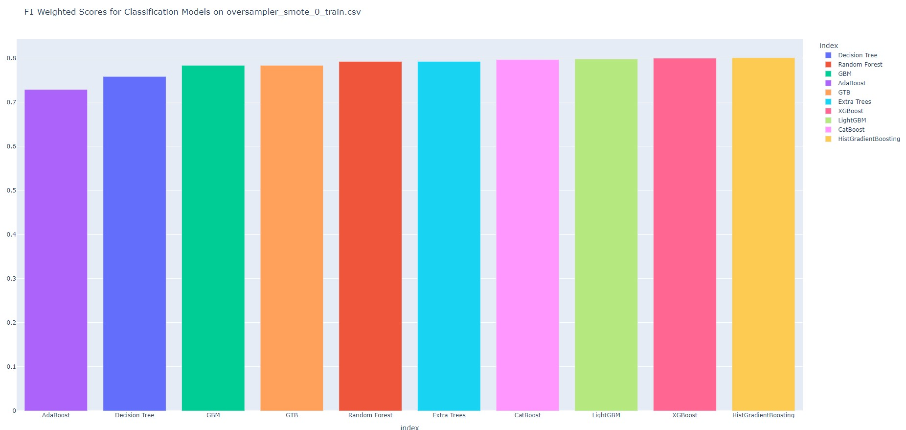
</p>
<p align="center"> 
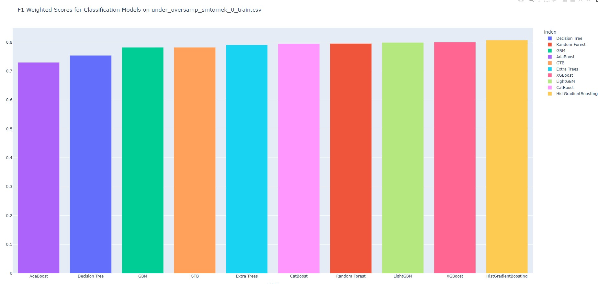
</p>
<p align="center"> 
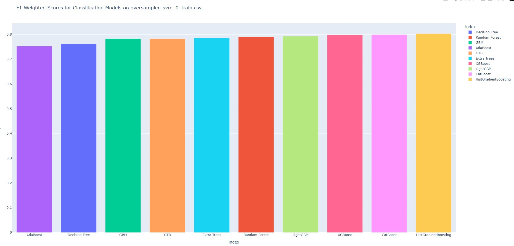
</p>

### Overview of the ***feature_selection.py*** Script
```bash
python src/feature_selection.py
```

The `feature_selection.py` script is a maestro of feature engineering and model evaluation. Its mission is to orchestrate a symphony of tasks that lead to enlightened data-driven decisions. Here's a panoramic view of its endeavors:

1. **Loading Data:** The script sets its course by navigating through a list of file names, elegantly ensconced within a YAML file. Each of these file names is a testament to the top-performing training datasets, meticulously chosen for their excellence.

2. **Feature Engineering and Model Evaluation:** Armed with these prized datasets, the script embarks on an odyssey of enlightenment. For each dataset, it embarks on a meticulous journey, diligently undertaking the following steps:
   - Invoking the training and testing data, the raw ingredients of wisdom.
   - Partitioning the data into two realms: the feature matrices (X) and the guardians of truth, the target labels (y).
   - Engaging in the arcane art of feature engineering. A symphony of transformations is orchestrated through a pipeline, with movements that involve pruning constant and duplicate features, and selecting the most relevant features using astute correlated selection.
   - Summoning a cast of classification models that includes Decision Trees, Random Forests, GBM (Gradient Boosting Machine), AdaBoost, Extra Trees, XGBoost, LightGBM, CatBoost, and HistGradientBoosting.
   - Appraising these models with the discerning F1 weighted score on the sacred testing data.
   - Extracting the wisdom of feature importances for models that benevolently provide them.

3. **Feature Importance Analysis:** For models that are generous enough to offer their feature importances (e.g., the venerable Random Forest or the sagacious XGBoost), the script dons the mantle of analysis. It calculates and chronicles the top 10 features of wisdom for each marriage of training dataset and model. The revelations of this analysis are meticulously preserved in separate CSV files.

4. **Resetting Warning Filters:** The script is a diplomat. It mends the delicate threads of communication by resetting warning filters that relate to XGBoost. This is an act of goodwill to prevent unintended FutureWarnings.

5. **Completion Message:** The script is not one for vanishing into the shadows. It takes a bow and graciously prints a message, a proclamation of its successful mission accomplished.

In summary, the `feature_selection.py` script is a maestro of data refinement and model enlightenment. It gracefully evaluates an ensemble of classification models on top-performing training datasets, unveils the wisdom of feature importances, and pens down the revelations of feature selection in separate CSV files. This script is an invaluable resource for those who seek to understand the intricate dance between data and models, where feature engineering plays the lead role.

*Note: Executing this script unveils a treasure trove of insights, with feature importances as the key to unlock its secrets.*


### Overview of the ***feature_selection_analysis.py*** Script
```bash
python src/feature_selection_analysis.py
```

The `feature_selection_analysis.py` script is a virtuoso of feature analysis and model evaluation. Its mission is to illuminate the path to data-driven wisdom. Here's an overview of its orchestrated endeavors:

1. **Initialize Classification Models:** At the heart of its performance, the script assembles a prestigious roster of classification models. Decision Tree, Random Forest, Gradient Boosting, AdaBoost, Extra Trees, XGBoost, LightGBM, and CatBoost are among the seasoned models ready to take the stage.

2. **Load Data:** The script sets its stage by loading a list of file names gracefully stored within a YAML file. These files are the heralds of top-performing training datasets, carefully curated for their excellence.

3. **Feature Importance Analysis and Model Evaluation:** The script gracefully dances through each marriage of training dataset and model, elegantly executing the following steps:
   - It summons the top 10 important features from previously archived feature importance files.
   - The grand dataset, the star of the show, is meticulously loaded.
   - The data is adorned with the final touches of preprocessing: feature scaling and encoding of the target variable.
   - The model, selected from the ensemble of models, takes center stage, trained exclusively on the top 10 features.
   - The testing dataset, a companion to the training data, is gracefully ushered in.
   - The same top 10 features, now a part of the test data, perform their roles.
   - The model, seasoned by the training data, takes a bow, making predictions with grace.
   - The audience of metrics is enchanted as the F1 weighted score is revealed, a testament to model prowess.
   - The F1 score, a measure of harmony, is carefully recorded in a dictionary for posterity.

4. **Save Results:** The script crafts a tableau, a DataFrame that houses the results. Each entry elegantly captures the essence: the filename, the model's name, and the F1 weighted score. These results are then archived in a CSV file, a treasure trove of wisdom.

5. **Create F1 Score DataFrames:** Like chapters in an epic, the script fashions DataFrames from the F1 scores, a chronicle of performances for each top-performing training dataset.

6. **Generate Bar Plots:** The script employs the artistry of visualization, crafting bar plots using Plotly. Each pair of training and testing data takes its turn on stage, revealing F1 weighted scores for the distinguished models. These visual masterpieces are saved as HTML files for all to behold.

7. **Completion Message:** The script concludes its performance with a flourish, printing a message to declare the final curtain's descent.

In summary, the `feature_selection_analysis.py` script is a virtuoso of data refinement and model evaluation. It gracefully conducts feature importance analysis on top-performing training datasets, weaving an intricate tapestry of model evaluations. These revelations are carefully archived, presented through visualizations, and shared with the world. This script is a symphony of wisdom for those who seek to uncover the profound relationship between features, models, and performance.
<p align="center"> 
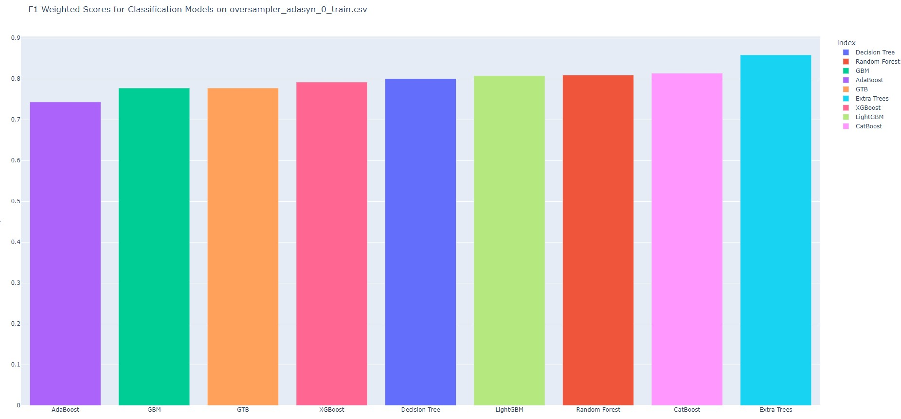
</p>

<p align="center"> 
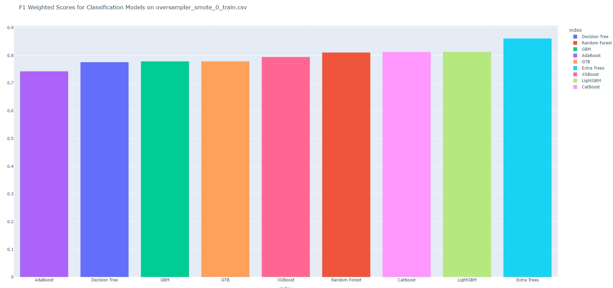
</p>
<p align="center"> 
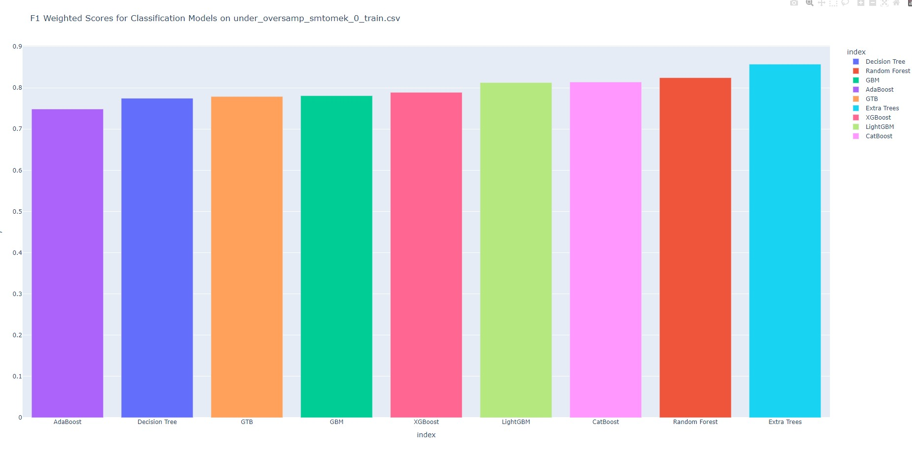
</p>
<p align="center"> 
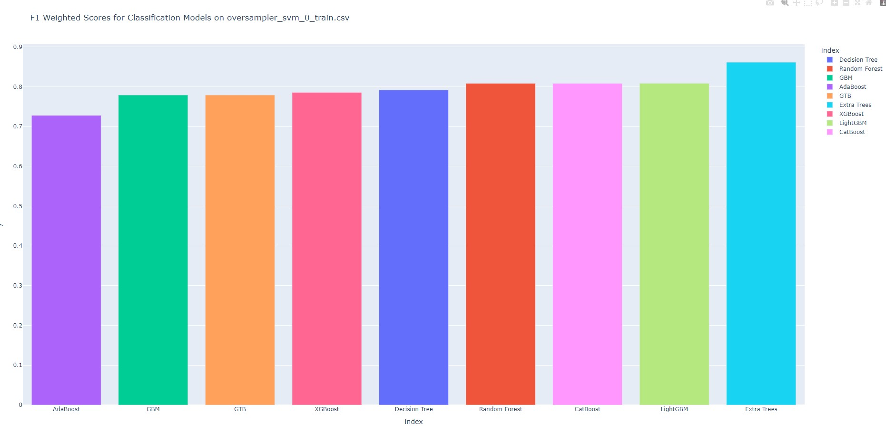
</p>


### Overview of the ***hp_tuning_et.py*** Script
```bash
python src/hp_tuning_et.py
```


The `hp_tuning_et.py` script is a virtuoso of hyperparameter tuning for the ExtraTreesClassifier, guided by the harmonious principles of Bayesian Optimization. Here's an overview of its orchestrated endeavors:

1. **Hyperparameter Search Space Definition:** Like a composer arranging notes, the script defines a search space for hyperparameters. This includes the number of estimators (trees), maximum depth of trees, minimum samples required to split a node, minimum samples required to be a leaf, maximum features to consider for splitting, and the choice of using bootstrap samples.

2. **Bayesian Optimization Setup:** The script sets up a stage for Bayesian Optimization using the `BayesSearchCV` object from the scikit-optimize (`skopt`) library. The aim is to maximize the F1 weighted score, and a 5-fold cross-validation ensemble acts as the jury to evaluate candidate models. The optimization symphony runs in parallel across available CPU cores, harmonizing computational resources.

3. **Loading Data:** The script gracefully summons a list of file names from a YAML file. These files represent the finest training datasets, carefully curated for their excellence.

4. **Feature Importance Analysis:** Each dataset, like a distinguished soloist, receives the spotlight. The script artfully retrieves the top 10 important features from previously archived feature importance files.

5. **Training and Hyperparameter Tuning:** The show begins. The training dataset is introduced, and the top 10 features take center stage. Bayesian Optimization, the conductor, guides the search for the perfect hyperparameters for an ExtraTreesClassifier. The best hyperparameters are the symphony's crescendo. A new ExtraTreesClassifier, tuned to perfection, emerges from the orchestra pit.

6. **Recording Top Model Results:** The stars are celebrated. The script meticulously records details about the top-performing model, including the filename, model name, best hyperparameters, and the best F1 weighted score. This information is etched into the script's scorecard.

7. **Saving Results:** Like an archivist preserving musical manuscripts, the script creates a grand DataFrame from the list of top model results. This ledger of excellence is archived into a CSV file, a testament to the search for perfection.

8. **Completion Message:** As the final note resonates, the script takes a bow, printing a message to declare the grand finale.

In summary, the `hp_tuning_et.py` script is a virtuoso of hyperparameter tuning, orchestrating the harmony between hyperparameters and model performance for the ExtraTreesClassifier. It records the symphony of best hyperparameters and the crescendo of F1 weighted scores for each training dataset. These results are preserved for all to admire and analyze—a masterpiece of model optimization.

### Overview of the ***train_and_evaluate_model.py*** Script
```bash
python src/train_and_evaluate_model.py
```

The `train_and_evaluate_model.py` script is your virtuoso for training and evaluating machine learning models with precision, guided by the wisdom of feature importance-based hyperparameters. Here's a glimpse into its masterful performance:

1. **Define a Function to Train and Evaluate a Model:** The script opens with a magnum opus—an exquisite function called `train_and_evaluate_model`. This function, like a maestro, conducts an orchestra of operations. It takes a filename and a set of hyperparameters as its audience. With grace, it loads feature importance information, deftly preprocesses data, then proceeds to train an ExtraTreesClassifier model, which it refines with the specified hyperparameters. The finale is a harmonious evaluation of model performance, measured by the F1 weighted score.

2. **Load Data and Define Directories:** Our script is nothing short of organized. It starts by summoning a list of file names from a YAML file. Here, it sets the stage with designated directories: one for feature importance files (`feature_importance_dir`), another for sample data (`sample_dir`), and a third for the majestic trained models (`model_dir`).

3. **Load Model Hyperparameters:** A true conductor knows the score. In this script, we open the pages of a DataFrame that holds secrets about top-performing models and their virtuoso hyperparameters, saved in a CSV file.

4. **Loop Through Models:** The heart of the performance is a mesmerizing loop that takes each row of the DataFrame—a representation of a top-performing model—and conducts the following acts:

   a. It gracefully extracts the filename and hyperparameters for the model, setting the scene for the model's encore.

   b. Our function `train_and_evaluate_model` takes the stage, training an ExtraTreesClassifier with the specified hyperparameters. The model sings, reaching its crescendo, and the audience responds with the applause of F1 weighted scores.

   c. Each model's filename and F1 weighted score are carefully noted, ready for an encore.

5. **Create a DataFrame for Plotting:** The script then assembles a stage—a DataFrame. It brings together the cast of model filenames and their respective F1 scores, preparing for the grand performance.

6. **Plot F1 Scores:** Like a finale, the script uses Plotly Express to craft a bar plot, a visualization of the F1 weighted scores. The models take their bow, with their F1 scores as the crescendo. The audience is presented with a grand spectacle of model performance, ranked in descending order of their F1 scores.

In summary, the `train_and_evaluate_model.py` script is your conductor for a symphony of model training and evaluation. It seamlessly orchestrates the training of ExtraTreesClassifier models using feature importance-driven hyperparameters and delivers a mesmerizing performance with the F1 weighted scores. This is not just script execution; it's a captivating masterpiece.

<p align="center"> 
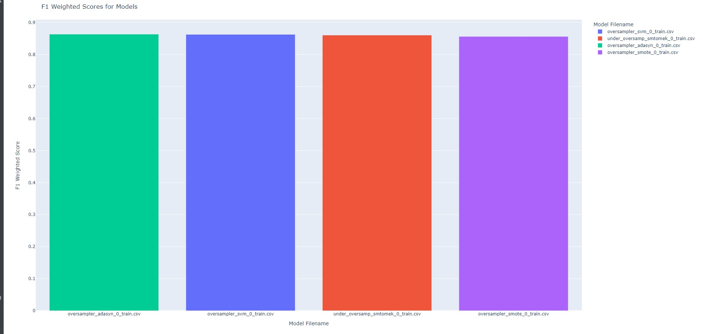
</p>
